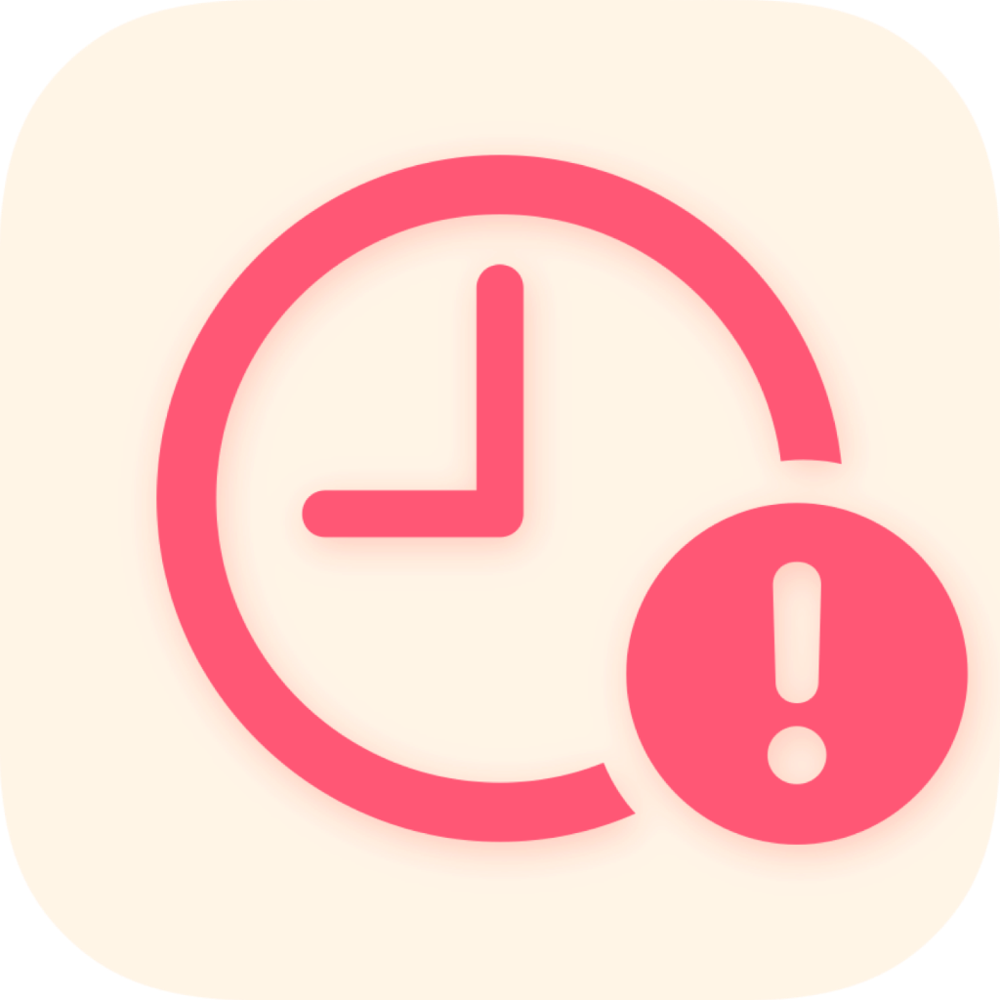

# Beep Hour
- [GitHub Repository](https://github.com/extratone/beep) 
- [Gist](https://gist.github.com/038e2a5d448a35566720cff64bbcac03)
- [WTF](https://davidblue.wtf/drafts/C3A69CD8-39ED-42C9-9EBF-7FE06A0AED15.html)

## Description

**Beep is a single, 12-line, 358-character AppleScript that plays a system notification sound for the numeric value of the current hour in quick succession. (Think grandfather clock.)**

See [the GitHub repository](https://github.com/extratone/beep) or otherwise [contact me](https://davidblue.wtf/db.vcf).

<video controls>
  <source src="video/beepdemo.mov">
</video>

---

12 lines, 358 characters, 

## Source 

```applescript
on getTimeInHours()
	-- Get the "hour"
	set timeStr to time string of (current date)
	set Pos to offset of ":" in timeStr
	set theHour to characters 1 thru (Pos - 1) of timeStr as string
	set timeStr to characters (Pos + 1) through end of timeStr as string
	return (theHour) as string
end getTimeInHours

set CurrentTime to getTimeInHours()

beep CurrentTime
```